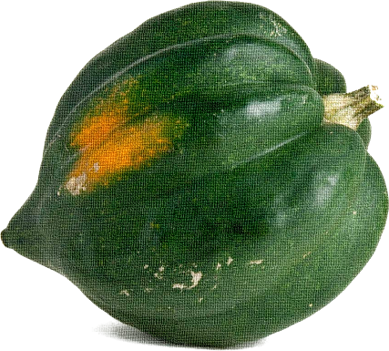

# squish-squash
overrides a system or user command for for all child processes

</img>

[ ](https://codeship.com/projects/120328)

## install
`npm install squish-squash [--save|--save-dev]`

## example
```js
var ss = require('squish-squash');
// example of squashng system or user cmds with arbitrary command
ss({
    squash: 'node',
    cmdpath: '/path/to/my/other/node'
});

// examples of squashing system or user cmds with system commands
ss({
    squash: 'more',
    syscmd: 'less'
});
ss({
    squash: 'grep',
    syscmd: 'ag'
});
```

## why
Because sometimes you gotta.  Use with caution!

# todo
- [ ] windoze support!  if you know windows, it'd be great to get your input
